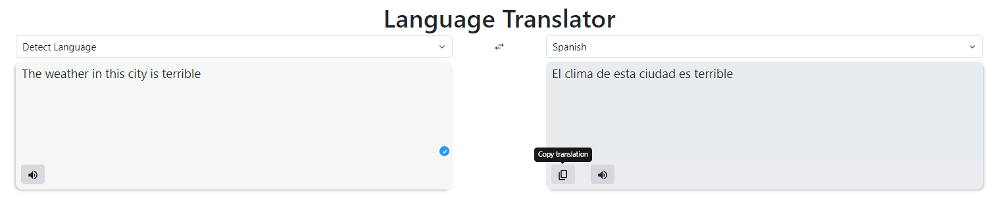

# Language Translator

This app was developed using Cohere API, & React + TypeScript.

Its a simple app that takes advantage of LLM to perform a translation of any given sentence. Used LLM in this case was Cohere.

The app consist on two TextAreas, one serves as input and the other as output of the translation, Cohere takes the sentence and then, by explicitly indicating how the output should be, it return the translation.

Input language can be inferred by the LLM.

